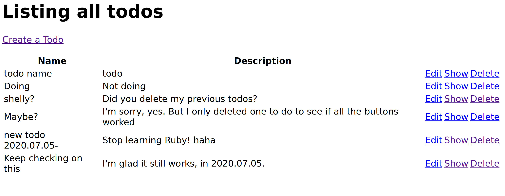

# To Do App

MVC (Model View Controller) app deployed on Heroku, that uses a postgreSQL database for storing todos. To-dos are persistent, so you may visit the [live page](https://miguel-todo-app.herokuapp.com/todos) and add/edit/delete some if you wish!.

- **Live app URL-** https://miguel-todo-app.herokuapp.com/todos

